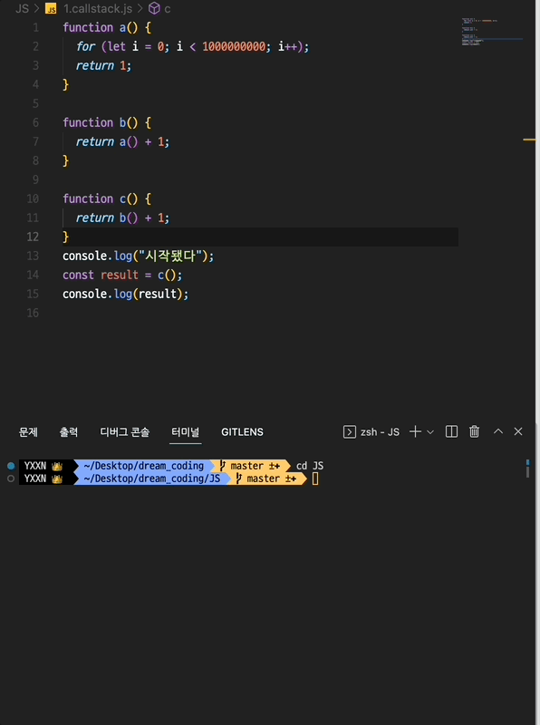

# 비동기 Async

자바스크립트에서 비동기와 동기를 이해하는 것이 매우 중요하다

동기적으로 실행할 수 있는 **callback**, 비동기적으로 실행할 수 있는 **callback** 두 가지의 차이점

동기를 조금 더 깔끔하게 작성할 수 있는 **promise**

비동기 코드를 동기적으로 작동할 수 있게 도와주는 **async / await**

<br />

### 자바스크립트 실행 순서(콜스택) JavaScript Runtime Environment

항상 자바스크립트 엔진이 탑재되어 있는데 그곳에서 우리의 소스 코드를 인식하고 실행한다

동적으로 객체를 생성하는 경우에는 Memory Heap에 소스가 생성이 되고

Call Stack 에서는 함수 실행 순서를 기억한다

<br />

예를 들어 전역으로 c()함수가 실행되면 콜스텍에 쌓이고 그 다음 b() 함수를 실행하면 b()도 콜스텍에 쌓인다. 그 다음으로 a()함수를 실행하면 동일하게 또 콜스텍에 쌓이게 된다.

그렇게 쌓인 함수들은 실행이 끝난 순서대로 콜스텍에서 나가게 되는데 함수들이 전부 실행이 종료되면 콜스텍은 결국 비게 된다.

즉, Call Stack은 함수의 실행 순서, 어디에서 실행이 되었는지, 어디로 돌아가야하는지의 정보들을 가지고 있다.

<br />

기본적으로 자바스크립트 엔진은 단 하나의 싱글 컨테스트 스택을 가지고 있다.

한 번에 한 가지 일만 수행할 수 있다. 이것을 single thread 싱글 쓰레드라고 한다.

단 하나의 스트림으로만 한 가지 일을 처리할 수 있다.

자바스크립트는 기본적으로 한 가지 하나만 처리할 수 있기 때문에 동기적으로 실행한다고도 한다.

<br />

### 다음 예시를 보며 확인을 해보자

```jsx
function a() {
  return 1;
}

function b() {
  return a() + 1;
}

function c() {
  return b() + 1;
}

const result = c();
console.log(result); // 3
```

→ 자바스크립트 엔진은 처음부터 끝까지 순차적으로 읽어나가고 일을 수행한다

위와 같은 코드에서 result라는 것으로 c 함수를 호출하였다.

그래서 c함수로 돌아가보니 return 값으로 b함수+1이어서 다시 b함수를 호출한다.

b함수의 return 값은 a함수+1이므로 다시 a 함수를 호출하였다.

**즉, c - b - a 순서대로 함수가 호출되었으니 call stack에서도 c() - b() - a() 순서대로 쌓여있다.**

<br />

그래서 a 함수에서 보니 1을 반환한다. 1을 가지고 다시 b 함수로 돌아가니 1 + 1 = 2, 2를 가지고 마지막으로 c 함수로 가니 2 + 1 = 3, result는 3이다.

**즉, 쌓인 순서 거꾸로 a() - b() - c() 순서대로 함수가 종료되어 call stack에서 비워졌다**

<br />

**여기서 잠깐, 그렇다면 a 함수가 오래 걸리는 무거운 함수라면 어떻게 될까?**

```jsx
function a() {
  for (let i = 0; i < 1000000000; i++);
  return 1;
}

function b() {
  return a() + 1;
}

function c() {
  return b() + 1;
}
console.log("시작됐다");
const result = c();
console.log(result);
```

→ 이렇게 a 함수에 for문으로 계속 순회하게 해서 시간이 오래 걸리면 어떻게 되는지 한번 알아보자

<br />



→ 이렇게 a 함수가 전체를 도는 동안 기다렸다가 result 값이 나오는 것을 확인할 수 있다.
